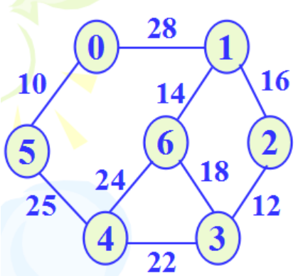
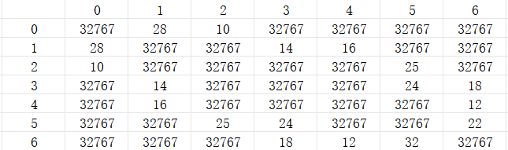
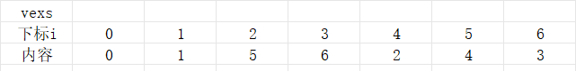
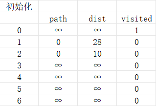
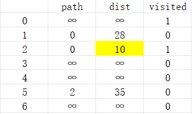
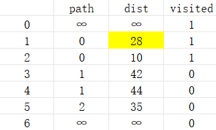
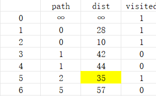
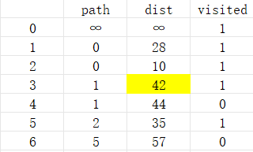
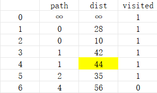
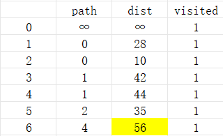

# Dijlstra（迪杰斯特拉）算法

## 最短路径问题

​		在有向网中 A 点 （源点）到达 B 点 （终点）的多条路径中，寻找一条各边权值之和最小的路径，即最短路径。

​		最短路径与最小生成树不同，路径上不一定包含n个顶点，也不定包含 n-1条边。

​		解决单源最短路径问题，通常采用用Diikstra （迪杰斯特拉）算法。

## 算法基本思想

​		**若已知v~0~ v~1~ v~2~ v~3~ v~4~ v~5~ v~6~......v~n~是v~0~到v~n~的最短路径，则途经的某顶点v~i~也为v~0~到v~i~最短路径。**

​		1.初始化：先找出从源点v~0~到各终点v~k~的直达路径 (v~0~,v~k~)即通过一条弧到达的路径

​		2.选择：从这些路径中找出一条长度最短的路径 (v~0~,u)

​		3.更新：然后对其余各条路径进行适当调整：

​		若在图中存在弧 (u,v~k~) ，且 (v~0~,u) + (u,v~k~) < (v~0~,v~k~)则以路径 (v~0~,u,v~k~) 代替 (v~0~,v~k~)

>  在调整后的各条路径中，再找长度最短的路径，依此类推

## 方法如下

​		以下图为例，求结点0到其他各个顶点的最短路径。



>  该图用邻接矩阵如是存储：
>
> 
>
> 顶点表：
>
> 


​		定义三个数组，`path`、`dist`、`visited`，path用于存储最短路径中结点的上一个结点，dist用于存储结点到源点的最短路径，visited用于存储该结点是否已经并入S(已求出最短路径的顶点的集合)

> 本算法中，path与dist存的都是结点在邻接表中对应的下标。例如，2结点对应的下标是4

- 初始化：

1. visited数组全部置为false，表示没有结点求出了最短路径
2. 源点v并入S，visited[v]置为true，表示求出了源点到源点的最短路径（或者表示不求这一路径）
3. 初始化path与dist，如果与源点邻接，path置为源点v，dist置为与源点v的距离，如果不邻接，全部置为∞

> 例如，上图初始化如图所示：
>
> 

- 递归求解

1. 遍历dist数组，找到最小的一个记为结点k，更新其对应的visited为1
2. 遍历path，如果某个结点m原有的path大于源点到结点k的距离加上结点k到结点m的距离，更新m的path为k，dist为源点到结点k的距离加上结点k到结点m的距离
3. 重复上述步骤

> 例如：上图第一次遍历后：
>
> 
>
> 第二次：
>
> 
>
> 第三次：
>
> 
>
> 第四次：
>
> 
>
> 第五次：
>
> 
>
> 第六次：
>
> 

​	循环结束后，每个下标到源点的距离记录在了dist中，每个下标的前一个结点的下标记录在了path中

> 例如，以6为下标的结点，它的最短路径：以0为下标->以1为下标->以4为下标->以6为下标

​	再将下标转回对应的结点内容就行了，从略。

## 代码实现

```c++
void outPutDijlstra(int path[],int dist[],AMGraph G,int v) {
	SqStack S;
	InitStack(S);
	for (int i = 0; i < G.vexnum; i++) {
		if (i != v) {
			int index = path[i];
			while (index != v) {
				Push(S, index);
				index = path[index];
			}
			cout << "结点" << v << "到结点" << G.vexs[i] << "的最短路径是：";
			cout << v ;
			while (S.top - S.base != 0) {
				int e;
				Pop(S, e);
				cout << " -> " << G.vexs[e];
			}
			cout<< " -> " << G.vexs[i];
			cout << "   距离为：" << dist[i];
			cout << endl;
			ClearStack(S);
		}
	}

}

void Dijlstra(AMGraph G, int v) {
	int path[MVNum];//用于存储路径
	int dist[MVNum];//用于存储路径的长度
	bool visited[MVNum];

	for (int i = 0; i < G.vexnum; i++) 
		visited[i] = false;
		
	visited[v] = true;

	for (int i = 0; i < G.vexnum; i++) {
		if (G.arcs[v][i] < MaxInt && visited[i] == false) {	
			path[i] = v;
			dist[i] = G.arcs[v][i];
		}
		else {
			path[i] = MaxInt;
			dist[i] = MaxInt;
		}
	}
	//以上是在初始化

	for (int p = 0; p < G.vexnum; p++) {

		int weight = 0;
		int k = -1;//用于记录dist最小的那个结点
		int min = MaxInt;
		for (int j = 0; j < G.vexnum; j++) {
			if (visited[j] != true && dist[j] < min) {
				k = j;
				min = dist[j];
				weight = dist[j];
			}
		}
		if(k!=-1)
			visited[k] = true;
		//遍历完之后，下标为k的结点的dist是最小值

		for (int i = 0; i < G.vexnum - 1; i++) {//遍历次数为顶点数-1
			for (int j = 0; j < G.vexnum; j++) {
				if (visited[j] != true && G.arcs[k][j] + weight < dist[j]) {
					dist[j] = G.arcs[k][j] + weight;
					path[j] = k;
				}
			}
		}
	}
	outPutDijlstra(path, dist, G, v);
}
```


