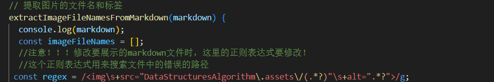
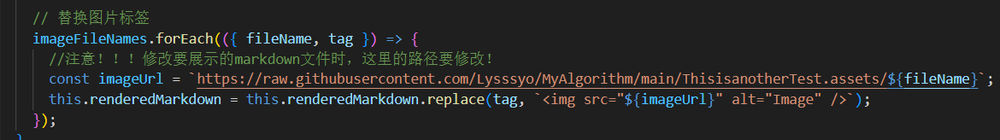
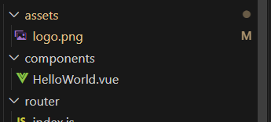

# 这是一个测试

## This is a test



#### 上面是一张图片



上面是另一张图片

下面是代码块：

```javascript
      // 替换图片标签
      imageFileNames.forEach(({ fileName, tag }) => {
        //注意！！！修改要展示的markdown文件时，这里的路径要修改！
        const imageUrl = `https://raw.githubusercontent.com/Lysssyo/MyAlgorithm/main/ThisisanotherTest.assets/${fileName}`;
        this.renderedMarkdown = this.renderedMarkdown.replace(tag, ``);
      });
```

下面都是图片





